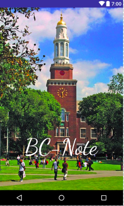
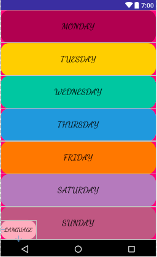
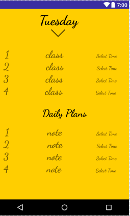
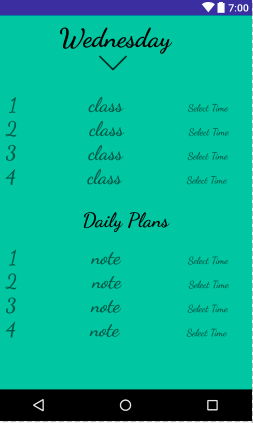

# **BC-NOTE**  :boom: :boom: :boom:
While I was interned in Georgia, I worked on the project BC-Note - an android app where students can save their daily class 
schedule and plans.
The app had the flash page with the BC campus picture on it, animated transitions between activities, seven colorful 
buttons(Monday through Sunday), an activity where students save class schedule/notes and time picker feature which allows 
students to set time for each task. 
The app includes the ability for the user to view it in different languages. 

### TO DO:
* A reminder feature that notifies students several minutes earlier before their class starts.
* Change the design of the language picker layout.
 
 
### CHALLENGES I RAN INTO:
I needed something that could save the data even if user stops the application or turn off the device. I put the data in
sharedPereferences (key/value) and commited it. 

I have seven Buttons so I should have seven different activities for each one. I created one activity and used putExtra()
method which gave me the opportunity to have seven different backgroud colors and different names of the weeks on it (Monday, Tuesday, Wednesday....)for one activity. It was a great method to save the memory.

### LANGUAGES/TOOLS USED:

**XML, JAVA, ANDROID STUDIO**

 
### HERE ARE SOME SCREENSHOT OF THE APP:

             
