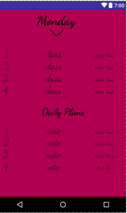

<b>#BC-Note</b>    

GENERAL INFO

While I was interned in Georgia, I worked on the project BC-Note---an android app where students can save their daily class 
schedule and plans.
The app had the flash page with the BC campus picture on it, animated transitions between activities, seven colorful 
buttons(Monday through Sunday), an activity where students save class schedule/notes and time picker feature which allows 
students to set time. 
The app includes the ability for the user to view it in different languages. 
____

TO DO:

Working on the reminder feature that notifies students several minutes earlier before their class starts.
 
 ____
 
CHALLENGES I RAN INTO:

I needed something that could save the data even if user stops the application or turn off the device. I put the data in
sharedPereferences (key/value) and commited it. 

I have seven Buttons so I should have seven different activities for each one. I created one activity and used putExtra()
method which gave me the opportunity to have seven different backgroud colors and name of days (Monday, Tuesday, Wednesday....)
for one activity. It helped me to save the memory of the app. 

 ______
 
LANGUAGES/TOOLS USED:

XML, JAVA, ANDROID STUDIO.
 
 ____
 
HERE ARE SOME SCREENSHOT OF THE APP:

